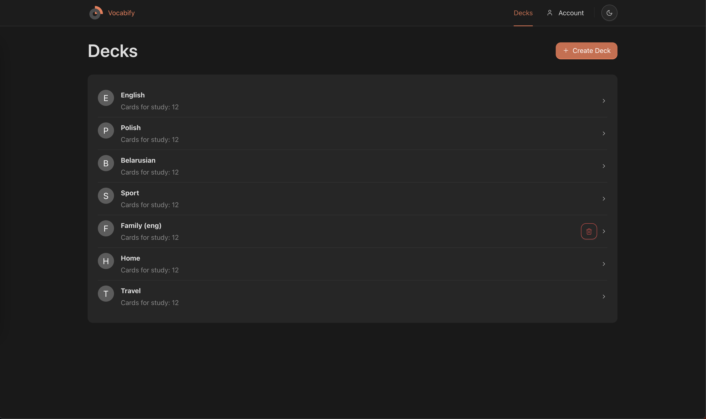
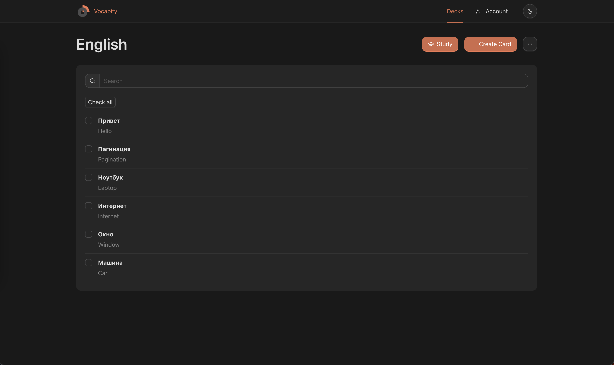
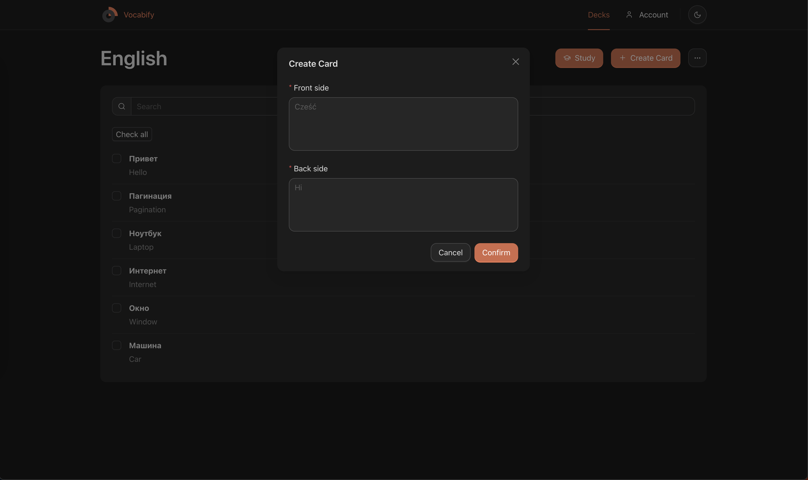

# Vocabify

## About 📝
Application for studying any information

## Launch developer mode 🏗

- ``npm ci && npm run dev``

## Screenshots 🤳
### Decks - Study groups

### Deck - Group with cards

### Creating a card
